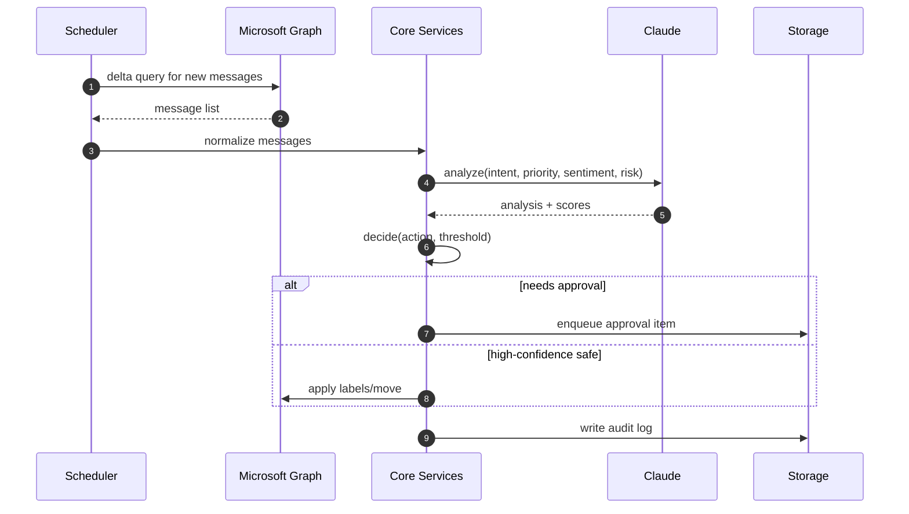

# Technical Plan: Outlook Email Automation

## Architecture Overview
- Language: Python 3.11+
- Email provider: Microsoft 365 via Microsoft Graph API
- AI provider: Anthropic Claude API for analysis and drafting
- Storage: SQLite (MVP) → PostgreSQL (production)
- Config/Secrets: .env + OS keyring in MVP → Azure Key Vault in production
- Packaging: poetry (preferred) or pip + requirements.txt
- CI/CD: GitHub Actions
- Observability: structured logging + OpenTelemetry-ready hooks

## High-Level Components
- config/
  - settings.py: Pydantic-based settings loader (env, .env)
  - secrets.py: secret retrieval abstraction
- src/core/
  - graph_client.py: Microsoft Graph API client (auth, requests)
  - message_models.py: Typed models for messages/attachments
  - storage.py: Repository for state (SQLite/Postgres)
  - logging.py: JSON structured logger setup
  - errors.py: error taxonomy and retry helpers
- src/ai/
  - claude_client.py: thin client with retries, timeouts
  - prompts/: system and task prompts
  - classifiers.py: intent, priority, sentiment, risk
  - drafting.py: response drafting with constraints
- src/logic/
  - categorize.py: rule + AI hybrid categorization
  - approvals.py: user approval queue and thresholds
  - actions.py: safe actions (label, move, draft)
  - scheduler.py: batch/interval processing
- src/interfaces/
  - cli.py: command line entry points for MVP
  - webhook.py: placeholder for future UI/webhook
- tests/: pytest suites mirroring modules

## Data Flow
1. Fetch new messages from Graph with delta queries
2. Normalize to internal models with minimal PII retained
3. Run AI analysis pipeline: intent, priority, sentiment, risk
4. Decide next action based on confidence and policy
5. If required, enqueue for user approval; else perform safe actions
6. Persist audit events and outcomes
7. Produce metrics and logs

## Sequence Diagram (Mermaid)

## Security Model
- Least-privilege OAuth scopes: Mail.Read, Mail.ReadWrite, Mail.Send as needed
- Token handling: MSAL with confidential client; refresh/rotate automatically
- Secrets: never commit; load from env/KeyVault
- Data minimization: store only message IDs and derived metadata, not full bodies unless approved
- Output safety: validate AI outputs (no links to external domains, strip PII)
- Prompt hardening: system prompts enforce non-execution and constraints

## Reliability & Resilience
- All external calls wrapped with retries (exponential backoff, jitter)
- Circuit breaker for AI and Graph
- Idempotent operations; dedupe by messageId + processing window
- Dead-letter queue table for failures with manual replay command

## Performance
- Batch size tuned (e.g., 25 messages per call)
- Parallelism via asyncio tasks with bounded semaphores
- Cache static data (mailbox folders, templates)

## Configuration
- ENV vars: APP_ENV, GRAPH_TENANT_ID, GRAPH_CLIENT_ID, GRAPH_CLIENT_SECRET, GRAPH_USER_ID, CLAUDE_API_KEY, DB_URL, LOG_LEVEL, APPROVAL_THRESHOLD, AUTO_ACTION_THRESHOLD
- Profiles: .env.example for local; production via secrets manager

## Testing Plan
- Unit: mocks for Graph/Claude; property tests for parsers
- Integration: Testcontainers for Postgres; responses/httpx-mock for HTTP
- E2E: smoke flow against test mailbox with seeded emails
- Security: secret scanning, dependency audit (safety, pip-audit), bandit

## Deployment
- GitHub Actions: lint, test, build, publish artifact; tagged deploys
- Packaging: Dockerfile with multi-stage build; run as non-root
- Runtime: container in Azure Container Apps/Functions, cron-like schedule

## Risks and Mitigations
- Graph throttling → backoff and delta tokens
- AI latency/cost → cache summaries, limit max tokens, batch analyses
- Misclassification → human-in-the-loop, explicit allowlist/denylist

## Non-Goals (for now)
- Full UI; start with CLI
- Organization-wide multi-tenant admin features
- Complex attachment processing (OCR)

## Acceptance for Technical Readiness (pre-logic)
- Project scaffolding present
- Config/secret handling wired
- Clients with stub methods and tests
- CI runs green
- Docs updated
